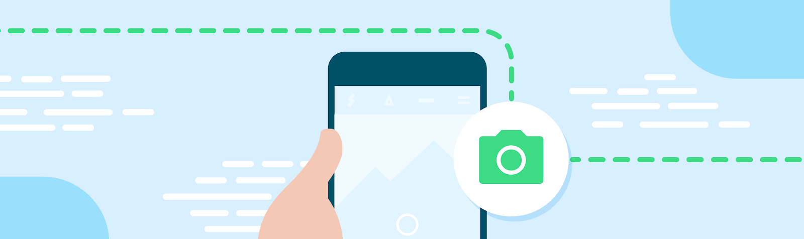

# Android CameraViewfinder

**Posted by Francesco Romano, Developer Relations Engineer, Android**



Over the years, Android devices have evolved to include a variety of sizes, shapes, and displays, among other features. Since the beginning, however, taking pictures with your phone has been one of the most important use cases. Today, camera capabilities are still one of the top reasons consumers purchase a phone.

As a developer, you want to leverage camera capabilities in your app, so you decide to adopt the Android Camera Framework. The first use case you want to implement is the Preview use case, which shows the output of the camera sensor on the screen.

So you go ahead and create a CaptureSession using a surface as big as the screen size. As long as the screen has the same aspect ratio as the camera sensor output and the device stays in its natural portrait orientation, everything should be fine.

But what happens when you resize the window, unfold your device, or change the display or orientation? Well, in most cases, the preview may appear stretched, upside down, or incorrectly rotated. And if you are in a multi-window environment, your app may even crash.

Why does this happen? Because of the implicit assumptions you made while creating the CaptureSession.

Historically, your app could live in the same window for its whole life cycle, but with the availability of new form factors such as foldable devices, and new display modes such as multi-window and multi-display, you can't assume this will be true anymore.

In particular, let's see some of the most important considerations when developing an app targeting various form factors:

### Common Pitfalls to Avoid

1. Don't assume your app will live in a portrait-shaped window. Requesting a fixed orientation is still supported in Android 13, but now device manufacturers may have the option of overriding an app request for a preferred orientation.
2. Don't assume any fixed dimension or aspect ratio for your app. Even if you set `resizableActivity = "false"`, your app could still be used in multi-window mode on large screens (>=600dp).
3. Don't assume a fixed relationship between the orientation of the screen and the camera. The Android Compatibility Definition Document specifies that a camera image sensor "MUST be oriented so that the long dimension of the camera aligns with the screen's long dimension." Starting with API level 32, camera clients that query the orientation on foldable devices can receive a value that dynamically changes depending on the device/fold state.
4. Don't assume the size of the inset can't change. The new taskbar is reported to applications as an inset, and when used with gesture navigation, the taskbar can be hidden and shown dynamically.
5. Don't assume your app has exclusive access to the camera. While your app is in a multi-window state, other apps can obtain access to shared resources like camera and microphone.

While CameraX already handles most of the cases above, implementing a preview that works in different scenarios with Camera2 APIs can be complex, as we describe in the [Support resizable surfaces in your camera app Codelab](link).

Wouldn’t it be great to have a simple component that takes care of those details and lets you focus on your specific app logic?

Say no more…

### Introducing CameraViewfinder

CameraViewfinder is a new artifact from the Jetpack library that allows you to quickly implement camera previews with minimal effort. It internally uses either a TextureView or SurfaceView to display the camera feed, and applies the required transformations on them to correctly display the viewfinder. This involves correcting their aspect ratio, scale, and rotation. It is fully compatible with your existing Camera2 codebase and continuously tested on several devices.

### How to Use CameraViewfinder

First, add the dependency in your app-level `build.gradle` file:

```gradle
    implementation "androidx.camera:camera-viewfinder:1.3.0-alpha01"
```
Sync your project. Now you should be able to directly use the CameraViewfinder as any other View. For example, you can add it to your layout file:

```
    <androidx.camera.viewfinder.CameraViewfinder
      android:id="@+id/view_finder"
      app:scaleType="fitCenter"
      app:implementationMode="performance"
      android:layout_width="match_parent"
      android:layout_height="match_parent"/>
```

As you can see, CameraViewfinder has the same controls available on PreviewView, so you can choose different Implementation modes and scaling types.

Now that the component is part of the layout, you can still create a CameraCaptureSession, but instead of providing a TextureView or SurfaceView as target surfaces, use the result of requestSurfaceAsync().

```
    fun startCamera(){
    val previewResolution = Size(width, height)
    val viewfinderSurfaceRequest =
    ViewfinderSurfaceRequest(previewResolution, characteristics)
    val surfaceListenableFuture =
    cameraViewfinder.requestSurfaceAsync(viewfinderSurfaceRequest)
        Futures.addCallback(surfaceListenableFuture, object : FutureCallback<Surface> {
            override fun onSuccess(surface: Surface) {
                //create a CaptureSession using this surface as usual
            }
            override fun onFailure(t: Throwable) { /* something went wrong */}
        }, ContextCompat.getMainExecutor(context))
    }
```

#### Bonus: Optimized Layouts for Foldable Devices

CameraViewFinder is ready-to-use across resizable surfaces, configuration changes, rotations, and multi-window modes, and it has been tested on many foldable devices.

But if you want to implement optimized layouts for foldable and dual screen devices, you can combine CameraViewFinder with the Jetpack WindowManager library to provide unique experiences for your users.

For example, you can choose to avoid showing full screen preview if there is a hinge in the middle of the screen, or if the device is in “book” or “tabletop” mode. In those scenarios, you can have the viewfinder in one portion of the screen and the controls on the other side, or you can use part of the screen to show the last pictures taken. Imagination is the limit!

The sample app is already optimized for foldable devices and you can find the code to handle posture changes here. Have a look!

Please make sure to replace `image_url` and `link` with the actual image URL and the correct hyperlink respectively.
